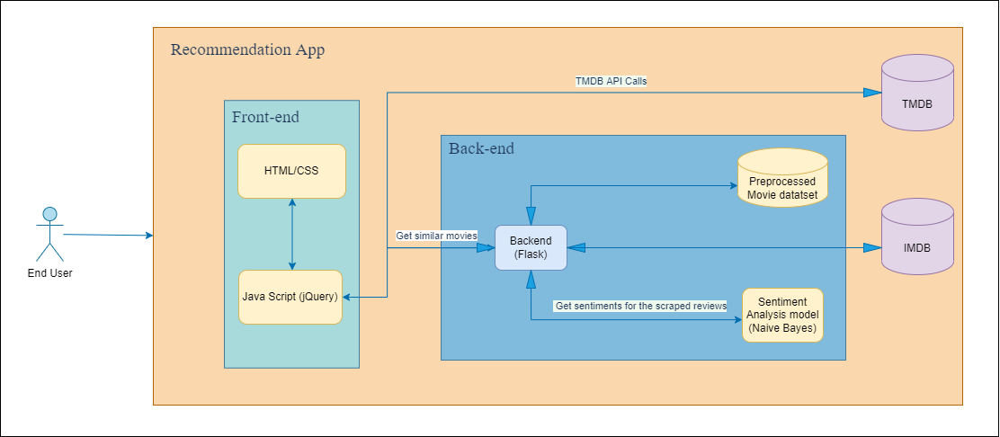
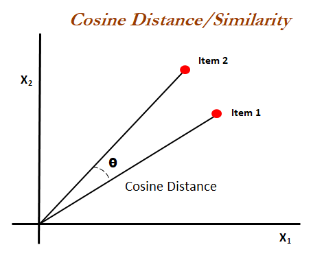

# Movie-Recommender-System

Content Based Recommender System recommends movies similar to the movie user likes and analyses the sentiments on the reviews given by the user for that movie.

The details of the movies(title, genre, runtime, rating, poster, etc) are fetched using an API by TMDB, https://www.themoviedb.org/documentation/api, and using the IMDB id of the movie in the API, I did web scraping to get the reviews given by the user in the IMDB site using `beautifulsoup4` and performed sentiment analysis on those reviews.

Don't worry if the movie that you are looking for is not auto-suggested. Just type the movie name and click on "enter". You will be good to go eventhough if you made some typo errors.

## How to run the project?

1. Clone or download this repository to your local machine.
2. Install all the libraries mentioned in the requirements.txt file with the command `pip install -r requirements.txt`
3. Open your terminal/command prompt from your project directory and run the file `main.py` by executing the command `python main.py`.
4. Go to your browser and type `http://127.0.0.1:5000/` in the address bar.
5. Hurray! That's it.

## Architecture

## Similarity Score :

   How does it decide which item is most similar to the item user likes? Here come the similarity scores.

   It is a numerical value ranges between zero to one which helps to determine how much two items are similar to each other on a scale of zero to one. This similarity score is obtained measuring the similarity between the text details of both of the items. So, similarity score is the measure of similarity between given text details of two items. This can be done by cosine-similarity.

## How Cosine Similarity works?
  Cosine similarity is a metric used to measure how similar the documents are irrespective of their size. Mathematically, it measures the cosine of the angle between two vectors projected in a multi-dimensional space. The cosine similarity is advantageous because even if the two similar documents are far apart by the Euclidean distance (due to the size of the document), chances are they may still be oriented closer together. The smaller the angle, higher the cosine similarity.

  

More about Cosine Similarity : [Understanding the Math behind Cosine Similarity](https://www.machinelearningplus.com/nlp/cosine-similarity/)

### Sources of the datasets

1. [IMDB 5000 Movie Dataset](https://www.kaggle.com/carolzhangdc/imdb-5000-movie-dataset)
2. [The Movies Dataset](https://www.kaggle.com/rounakbanik/the-movies-dataset)
3. [List of movies in 2020](https://en.wikipedia.org/wiki/List_of_American_films_of_2020)
4. [List of movies in 2019](https://en.wikipedia.org/wiki/List_of_American_films_of_2019)
5. [List of movies in 2018](https://en.wikipedia.org/wiki/List_of_American_films_of_2018)
